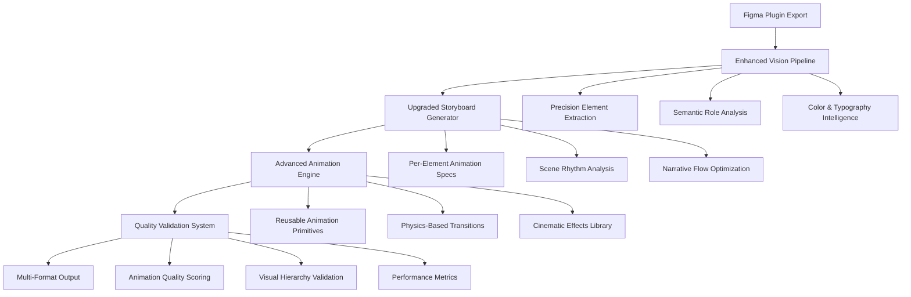
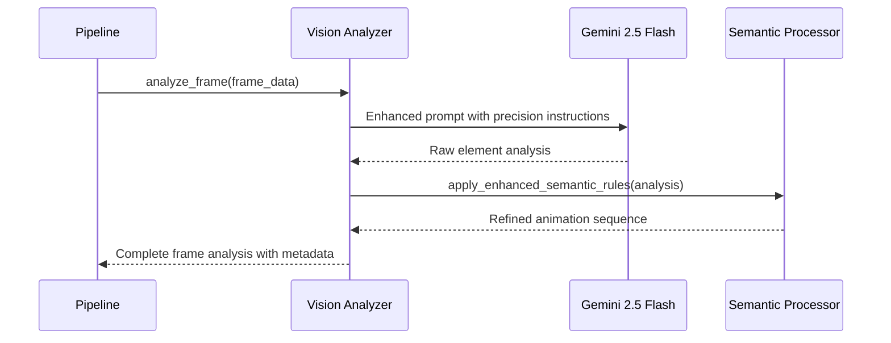
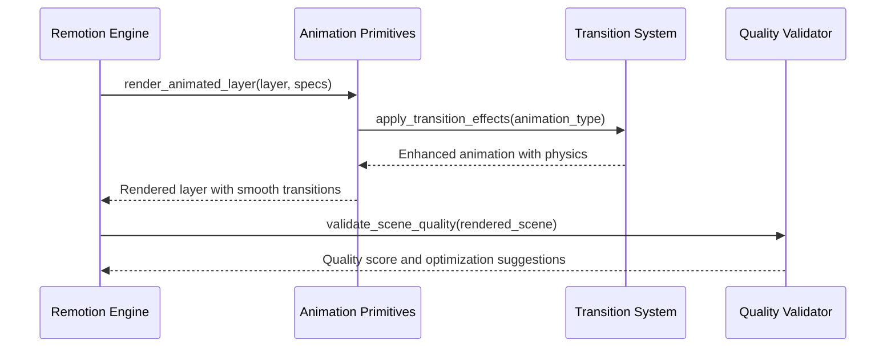

# Design Document: LaunchVid Quality Enhancement

## Overview

This design enhances LaunchVid's output quality through five key improvements: precision vision prompts for exact element extraction, upgraded storyboard schema with per-element timing control, sophisticated Remotion animation primitives, advanced scene transition system, and automated quality validation. The system transforms basic app preview generation into professional-grade animated marketing videos with cinematic timing, smooth transitions, and semantic animation intelligence.

## Architecture



## Sequence Diagrams

### Enhanced Vision Analysis Flow



### Advanced Animation Rendering Flow



## Components and Interfaces

### Component 1: Enhanced Vision Analyzer

**Purpose**: Extracts precise element positioning, semantic roles, and animation intent from Figma frames

**Interface**:
```typescript
interface EnhancedVisionAnalyzer {
  analyzeFrame(frame: FrameData): Promise<EnhancedFrameAnalysis>
  extractElementHierarchy(layers: LayerData[]): ElementHierarchy
  determineSemanticRoles(elements: Element[]): SemanticRoleMap
  calculateOptimalAnimationSequence(elements: Element[]): AnimationSequence
}

interface EnhancedFrameAnalysis {
  frameId: string
  screenPurpose: ScreenPurpose
  visualHierarchy: VisualHierarchy
  colorPalette: ColorPalette
  typographySystem: TypographySystem
  animationSequence: EnhancedAnimationStep[]
  qualityMetrics: QualityMetrics
}

interface EnhancedAnimationStep {
  layerId: string
  semanticRole: SemanticRole
  animationType: AnimationType
  timing: AnimationTiming
  physics: PhysicsConfig
  dependencies: string[]
  qualityScore: number
}
```

**Responsibilities**:
- Extract precise element positioning and dimensions
- Identify semantic roles (hero, CTA, navigation, content)
- Analyze visual hierarchy and reading flow
- Generate physics-based animation parameters
- Calculate quality metrics for each element

### Component 2: Advanced Storyboard Generator

**Purpose**: Creates sophisticated scene timing with per-element control and narrative flow optimization

**Interface**:
```typescript
interface AdvancedStoryboardGenerator {
  generateStoryboard(frames: EnhancedFrameAnalysis[], context: AppContext): Promise<AdvancedStoryboard>
  optimizeSceneRhythm(scenes: Scene[]): Scene[]
  calculateNarrativeFlow(scenes: Scene[]): NarrativeFlow
  validateStoryboardQuality(storyboard: AdvancedStoryboard): QualityReport
}

interface AdvancedStoryboard {
  appName: string
  tagline: string
  totalFrames: number
  fps: number
  scenes: AdvancedScene[]
  narrativeFlow: NarrativeFlow
  qualityScore: number
}

interface AdvancedScene {
  sceneIndex: number
  sceneType: SceneType
  startFrame: number
  durationFrames: number
  transitionIn: AdvancedTransition
  transitionOut: AdvancedTransition
  screenIndex: number | null
  narration: NarrationSpec
  audioPath: string | null
  elementAnimations: ElementAnimationSpec[]
  sceneRhythm: RhythmSpec
}
```

**Responsibilities**:
- Generate per-element animation timing specifications
- Optimize scene rhythm for engagement and comprehension
- Create smooth narrative flow between scenes
- Validate storyboard quality and suggest improvements

### Component 3: Remotion Animation Primitives

**Purpose**: Provides reusable, physics-based animation components with cinematic effects

**Interface**:
```typescript
interface RemotionAnimationPrimitives {
  createAnimatedLayer(layer: LayerData, specs: AnimationSpec): React.Component
  applyPhysicsTransition(animation: AnimationType, config: PhysicsConfig): TransitionStyle
  renderCinematicEffect(effect: CinematicEffect, progress: number): CSSProperties
  optimizePerformance(animations: Animation[]): OptimizedAnimations
}

interface AnimationSpec {
  type: AnimationType
  timing: TimingSpec
  physics: PhysicsConfig
  easing: EasingFunction
  dependencies: AnimationDependency[]
  qualityTarget: QualityTarget
}

interface PhysicsConfig {
  mass: number
  tension: number
  friction: number
  velocity: number
  precision: number
}
```

**Responsibilities**:
- Render smooth, physics-based animations
- Provide reusable animation primitives
- Apply cinematic effects and transitions
- Optimize animation performance

### Component 4: Scene Transition System

**Purpose**: Handles sophisticated transitions between scenes with cinematic effects

**Interface**:
```typescript
interface SceneTransitionSystem {
  createTransition(from: Scene, to: Scene, type: TransitionType): Transition
  applyTransitionEffects(transition: Transition, progress: number): TransitionStyle
  optimizeTransitionTiming(transitions: Transition[]): Transition[]
  validateTransitionQuality(transition: Transition): QualityScore
}

interface AdvancedTransition {
  type: TransitionType
  duration: number
  easing: EasingFunction
  effects: CinematicEffect[]
  physics: PhysicsConfig
  qualityScore: number
}
```

**Responsibilities**:
- Create smooth transitions between scenes
- Apply cinematic effects during transitions
- Optimize transition timing for flow
- Validate transition quality

### Component 5: Quality Validation System

**Purpose**: Automatically scores output quality and suggests improvements

**Interface**:
```typescript
interface QualityValidationSystem {
  scoreAnimationQuality(animation: Animation): QualityScore
  validateVisualHierarchy(scene: Scene): HierarchyScore
  assessPerformanceMetrics(render: RenderResult): PerformanceScore
  generateImprovementSuggestions(scores: QualityScores): Suggestion[]
}

interface QualityScore {
  overall: number
  smoothness: number
  timing: number
  hierarchy: number
  performance: number
  suggestions: string[]
}
```

**Responsibilities**:
- Score animation quality across multiple dimensions
- Validate visual hierarchy and reading flow
- Assess rendering performance
- Generate actionable improvement suggestions

## Data Models

### Model 1: Enhanced Animation Specification

```typescript
interface EnhancedAnimationSpec {
  layerId: string
  semanticRole: SemanticRole
  animationType: AnimationType
  timing: {
    delay: number
    duration: number
    startFrame: number
    endFrame: number
  }
  physics: {
    mass: number
    tension: number
    friction: number
    velocity: number
  }
  easing: EasingFunction
  dependencies: AnimationDependency[]
  effects: CinematicEffect[]
  qualityMetrics: {
    smoothness: number
    timing: number
    impact: number
  }
}

type SemanticRole = 
  | "hero_image" 
  | "headline" 
  | "body_text" 
  | "cta_button" 
  | "navigation" 
  | "background" 
  | "decoration"

type AnimationType = 
  | "fade_in" 
  | "slide_up" 
  | "slide_right" 
  | "slide_left" 
  | "scale_in" 
  | "zoom_in" 
  | "pulse" 
  | "typewriter"
  | "elastic_bounce"
  | "magnetic_pull"
  | "parallax_scroll"
  | "morphing_shape"
```

**Validation Rules**:
- All timing values must be positive numbers
- Dependencies must reference valid layer IDs
- Physics values must be within realistic ranges
- Quality metrics must be between 0 and 1

### Model 2: Advanced Scene Configuration

```typescript
interface AdvancedSceneConfig {
  sceneIndex: number
  sceneType: SceneType
  timing: {
    startFrame: number
    durationFrames: number
    transitionInDuration: number
    transitionOutDuration: number
  }
  rhythm: {
    pace: "slow" | "medium" | "fast"
    emphasis: "subtle" | "moderate" | "dramatic"
    flow: "linear" | "accelerating" | "decelerating"
  }
  transitions: {
    in: AdvancedTransition
    out: AdvancedTransition
  }
  elementAnimations: ElementAnimationSpec[]
  qualityTargets: {
    smoothness: number
    engagement: number
    comprehension: number
  }
}
```

**Validation Rules**:
- Scene duration must be between 60-600 frames
- Transition durations must not exceed scene duration
- Element animations must fit within scene timing
- Quality targets must be between 0 and 1

## Algorithmic Pseudocode

### Main Quality Enhancement Algorithm

```pascal
ALGORITHM enhanceVideoQuality(frames, appContext)
INPUT: frames of type FrameData[], appContext of type AppContext
OUTPUT: enhancedVideo of type VideoOutput

BEGIN
  ASSERT frames.length > 0 AND appContext.isValid()
  
  // Step 1: Enhanced vision analysis with precision extraction
  enhancedAnalysis ← []
  FOR each frame IN frames DO
    ASSERT frame.isValid() AND frame.hasLayers()
    
    analysis ← analyzeFrameWithPrecision(frame)
    semanticRoles ← extractSemanticRoles(analysis.elements)
    visualHierarchy ← calculateVisualHierarchy(analysis.elements)
    
    enhancedAnalysis.add({
      frameAnalysis: analysis,
      semanticRoles: semanticRoles,
      visualHierarchy: visualHierarchy,
      qualityScore: calculateFrameQuality(analysis)
    })
  END FOR
  
  // Step 2: Advanced storyboard generation with rhythm optimization
  storyboard ← generateAdvancedStoryboard(enhancedAnalysis, appContext)
  optimizedStoryboard ← optimizeSceneRhythm(storyboard)
  
  ASSERT optimizedStoryboard.qualityScore >= MINIMUM_QUALITY_THRESHOLD
  
  // Step 3: Physics-based animation rendering
  renderedScenes ← []
  FOR each scene IN optimizedStoryboard.scenes DO
    animatedElements ← []
    
    FOR each element IN scene.elements DO
      ASSERT element.animationSpec.isValid()
      
      animatedElement ← renderWithPhysics(element, scene.timing)
      qualityScore ← validateAnimationQuality(animatedElement)
      
      IF qualityScore < QUALITY_THRESHOLD THEN
        animatedElement ← optimizeAnimation(animatedElement)
      END IF
      
      animatedElements.add(animatedElement)
    END FOR
    
    renderedScene ← composeScene(animatedElements, scene.transitions)
    renderedScenes.add(renderedScene)
  END FOR
  
  // Step 4: Quality validation and optimization
  finalVideo ← composeVideo(renderedScenes)
  qualityReport ← validateVideoQuality(finalVideo)
  
  IF qualityReport.overall < TARGET_QUALITY THEN
    finalVideo ← applyQualityImprovements(finalVideo, qualityReport.suggestions)
  END IF
  
  ASSERT finalVideo.qualityScore >= TARGET_QUALITY
  
  RETURN finalVideo
END
```

**Preconditions**:
- frames array contains valid FrameData objects with layer trees
- appContext provides valid application metadata
- All required animation libraries and resources are available

**Postconditions**:
- Returns enhanced video with quality score >= TARGET_QUALITY
- All animations are smooth and properly timed
- Visual hierarchy is preserved and enhanced
- Performance metrics meet optimization targets

**Loop Invariants**:
- All processed frames maintain valid structure throughout analysis
- Quality scores never decrease during optimization passes
- Animation timing remains consistent across all elements

### Precision Element Extraction Algorithm

```pascal
ALGORITHM analyzeFrameWithPrecision(frame)
INPUT: frame of type FrameData
OUTPUT: analysis of type PrecisionAnalysis

BEGIN
  ASSERT frame.layers.isValid() AND frame.fullPngBase64.isNotEmpty()
  
  // Step 1: Extract element hierarchy with precise positioning
  elements ← []
  layerQueue ← [frame.layers]
  
  WHILE layerQueue.isNotEmpty() DO
    currentLayer ← layerQueue.dequeue()
    
    element ← {
      id: currentLayer.id,
      position: calculatePrecisePosition(currentLayer),
      dimensions: calculatePreciseDimensions(currentLayer),
      visualWeight: calculateVisualWeight(currentLayer),
      semanticHints: extractSemanticHints(currentLayer.name, currentLayer.type)
    }
    
    elements.add(element)
    
    FOR each child IN currentLayer.children DO
      layerQueue.enqueue(child)
    END FOR
  END WHILE
  
  // Step 2: Analyze visual hierarchy and reading flow
  visualHierarchy ← calculateVisualHierarchy(elements)
  readingFlow ← analyzeReadingFlow(elements, visualHierarchy)
  
  // Step 3: Extract color palette and typography system
  colorPalette ← extractColorPalette(elements)
  typographySystem ← analyzeTypographySystem(elements)
  
  // Step 4: Generate optimal animation sequence
  animationSequence ← generateOptimalAnimationSequence(
    elements, 
    visualHierarchy, 
    readingFlow
  )
  
  RETURN {
    elements: elements,
    visualHierarchy: visualHierarchy,
    readingFlow: readingFlow,
    colorPalette: colorPalette,
    typographySystem: typographySystem,
    animationSequence: animationSequence,
    qualityScore: calculateAnalysisQuality(elements, animationSequence)
  }
END
```

**Preconditions**:
- frame contains valid layer tree structure
- frame.fullPngBase64 contains valid base64 image data
- All layer objects have required properties (id, position, dimensions)

**Postconditions**:
- Returns complete precision analysis with all elements extracted
- Visual hierarchy accurately reflects design intent
- Animation sequence optimized for readability and engagement
- Quality score reflects analysis completeness and accuracy

**Loop Invariants**:
- All processed layers maintain valid structure and relationships
- Element hierarchy preserves parent-child relationships from original layer tree
- Visual weight calculations remain consistent across all elements

### Physics-Based Animation Rendering Algorithm

```pascal
ALGORITHM renderWithPhysics(element, animationSpec, sceneTimimg)
INPUT: element of type Element, animationSpec of type AnimationSpec, sceneTiming of type TimingSpec
OUTPUT: animatedElement of type AnimatedElement

BEGIN
  ASSERT element.isValid() AND animationSpec.isValid() AND sceneTiming.isValid()
  
  // Step 1: Initialize physics simulation
  physicsState ← {
    position: element.initialPosition,
    velocity: animationSpec.physics.velocity,
    acceleration: 0,
    mass: animationSpec.physics.mass,
    tension: animationSpec.physics.tension,
    friction: animationSpec.physics.friction
  }
  
  // Step 2: Calculate animation keyframes with physics
  keyframes ← []
  currentFrame ← animationSpec.timing.startFrame
  
  WHILE currentFrame <= animationSpec.timing.endFrame DO
    // Apply physics calculations
    force ← calculateSpringForce(physicsState, animationSpec.targetState)
    acceleration ← force / physicsState.mass
    physicsState.velocity ← physicsState.velocity + acceleration
    physicsState.velocity ← physicsState.velocity * (1 - animationSpec.physics.friction)
    physicsState.position ← physicsState.position + physicsState.velocity
    
    // Generate keyframe with easing
    progress ← (currentFrame - animationSpec.timing.startFrame) / animationSpec.timing.duration
    easedProgress ← applyEasing(progress, animationSpec.easing)
    
    keyframe ← {
      frame: currentFrame,
      position: physicsState.position,
      opacity: interpolate(easedProgress, 0, 1),
      scale: calculateScale(animationSpec.type, easedProgress),
      rotation: calculateRotation(animationSpec.type, easedProgress),
      effects: applyCinematicEffects(animationSpec.effects, easedProgress)
    }
    
    keyframes.add(keyframe)
    currentFrame ← currentFrame + 1
  END WHILE
  
  // Step 3: Optimize animation for smoothness
  optimizedKeyframes ← optimizeForSmoothness(keyframes)
  
  // Step 4: Validate animation quality
  qualityScore ← validateAnimationSmoothness(optimizedKeyframes)
  
  ASSERT qualityScore >= MINIMUM_ANIMATION_QUALITY
  
  RETURN {
    element: element,
    keyframes: optimizedKeyframes,
    qualityScore: qualityScore,
    performanceMetrics: calculatePerformanceMetrics(optimizedKeyframes)
  }
END
```

**Preconditions**:
- element has valid initial position and properties
- animationSpec contains valid physics parameters and timing
- sceneTiming provides valid frame boundaries

**Postconditions**:
- Returns smooth animation with physics-based motion
- All keyframes are within scene timing boundaries
- Animation quality meets minimum smoothness requirements
- Performance metrics are within acceptable ranges

**Loop Invariants**:
- Physics state remains numerically stable throughout simulation
- All keyframes maintain valid position and property values
- Animation progress increases monotonically from 0 to 1

## Key Functions with Formal Specifications

### Function 1: analyzeFrameWithPrecision()

```typescript
function analyzeFrameWithPrecision(frame: FrameData): Promise<PrecisionAnalysis>
```

**Preconditions:**
- `frame` is non-null and contains valid layer tree
- `frame.fullPngBase64` contains valid base64 image data
- `frame.layers` has at least one child element

**Postconditions:**
- Returns complete PrecisionAnalysis with all elements extracted
- `result.elements.length > 0` for valid frames
- `result.qualityScore >= 0.0 && result.qualityScore <= 1.0`
- All element positions are within frame boundaries

**Loop Invariants:** 
- For layer traversal: All processed layers maintain valid parent-child relationships
- Element extraction preserves original layer hierarchy structure

### Function 2: generateOptimalAnimationSequence()

```typescript
function generateOptimalAnimationSequence(
  elements: Element[], 
  hierarchy: VisualHierarchy, 
  readingFlow: ReadingFlow
): AnimationSequence
```

**Preconditions:**
- `elements` array is non-empty and all elements are valid
- `hierarchy` accurately reflects visual importance of elements
- `readingFlow` provides valid reading order for elements

**Postconditions:**
- Returns AnimationSequence with timing optimized for readability
- All animation delays respect visual hierarchy (important elements animate first)
- Total animation duration fits within scene timing constraints
- No animation conflicts or overlapping critical timings

**Loop Invariants:**
- For animation generation: All previously assigned timings remain valid
- Visual hierarchy order is preserved throughout sequence generation

### Function 3: renderWithPhysics()

```typescript
function renderWithPhysics(
  element: Element, 
  animationSpec: AnimationSpec, 
  sceneTiming: TimingSpec
): AnimatedElement
```

**Preconditions:**
- `element` has valid initial state and properties
- `animationSpec.physics` contains valid physics parameters (mass > 0, friction >= 0)
- `sceneTiming` provides valid frame boundaries

**Postconditions:**
- Returns AnimatedElement with smooth, physics-based motion
- All keyframes are within scene timing boundaries
- Animation quality score >= MINIMUM_ANIMATION_QUALITY
- Physics simulation remains numerically stable

**Loop Invariants:**
- For physics simulation: All state values remain within realistic bounds
- Keyframe generation maintains temporal consistency (frame numbers increase)

## Example Usage

```typescript
// Example 1: Enhanced frame analysis
const frame = {
  frameId: "frame_001",
  layers: layerTree,
  fullPngBase64: "iVBORw0KGgoAAAANSUhEUgAA..."
}

const analysis = await analyzeFrameWithPrecision(frame)
console.log(`Extracted ${analysis.elements.length} elements`)
console.log(`Quality score: ${analysis.qualityScore}`)

// Example 2: Advanced storyboard generation
const enhancedFrames = await Promise.all(
  frames.map(frame => analyzeFrameWithPrecision(frame))
)

const storyboard = await generateAdvancedStoryboard(enhancedFrames, {
  appName: "MyApp",
  category: "productivity",
  targetAudience: "professionals"
})

// Example 3: Physics-based animation rendering
const animationSpec = {
  type: "elastic_bounce",
  timing: { delay: 100, duration: 800, startFrame: 60, endFrame: 140 },
  physics: { mass: 1.0, tension: 300, friction: 0.1, velocity: 0 },
  easing: "easeOutElastic",
  effects: ["glow", "shadow"]
}

const animatedElement = await renderWithPhysics(element, animationSpec, sceneTiming)

// Example 4: Quality validation
const qualityReport = await validateVideoQuality(finalVideo)
if (qualityReport.overall < 0.8) {
  const improvedVideo = await applyQualityImprovements(
    finalVideo, 
    qualityReport.suggestions
  )
}
```

## Correctness Properties

The enhanced LaunchVid system maintains the following correctness properties:

**Property 1: Animation Timing Consistency**
```typescript
∀ scene ∈ storyboard.scenes, ∀ animation ∈ scene.animations:
  animation.startFrame >= scene.startFrame ∧ 
  animation.endFrame <= scene.startFrame + scene.durationFrames
```

**Property 2: Visual Hierarchy Preservation**
```typescript
∀ frame ∈ frames, ∀ elements e1, e2 ∈ frame.elements:
  hierarchy.importance(e1) > hierarchy.importance(e2) ⟹ 
  animation.delay(e1) <= animation.delay(e2)
```

**Property 3: Physics Simulation Stability**
```typescript
∀ animation ∈ animations, ∀ keyframe ∈ animation.keyframes:
  |keyframe.position| < MAX_POSITION_BOUND ∧
  |keyframe.velocity| < MAX_VELOCITY_BOUND ∧
  keyframe.frame ∈ [animation.startFrame, animation.endFrame]
```

**Property 4: Quality Score Monotonicity**
```typescript
∀ optimization ∈ qualityOptimizations:
  quality(optimize(video, optimization)) >= quality(video)
```

**Property 5: Performance Constraint Satisfaction**
```typescript
∀ scene ∈ renderedScenes:
  scene.renderTime <= MAX_RENDER_TIME ∧
  scene.memoryUsage <= MAX_MEMORY_USAGE ∧
  scene.frameRate >= MIN_FRAME_RATE
```

## Error Handling

### Error Scenario 1: Vision Analysis Failure

**Condition**: Gemini API fails or returns invalid JSON during frame analysis
**Response**: Apply enhanced fallback analysis with semantic rules and layer tree parsing
**Recovery**: Generate basic animation sequence based on layer hierarchy and naming conventions

### Error Scenario 2: Physics Simulation Instability

**Condition**: Physics parameters cause numerical instability or infinite values
**Response**: Reset physics state and apply conservative parameter bounds
**Recovery**: Fall back to standard easing functions while maintaining animation timing

### Error Scenario 3: Quality Validation Failure

**Condition**: Generated video fails to meet minimum quality thresholds
**Response**: Apply automated quality improvements and re-render affected scenes
**Recovery**: If improvements insufficient, flag for manual review with detailed quality report

### Error Scenario 4: Animation Timing Conflicts

**Condition**: Multiple animations overlap in ways that create visual conflicts
**Response**: Automatically resolve conflicts by adjusting delays and durations
**Recovery**: Maintain visual hierarchy while ensuring smooth animation flow

## Testing Strategy

### Unit Testing Approach

**Core Components Testing**:
- Test each animation primitive with various input parameters
- Validate physics simulation accuracy against known motion equations
- Verify quality scoring algorithms with reference animations
- Test error handling and fallback mechanisms

**Key Test Cases**:
- Precision element extraction with complex layer hierarchies
- Animation sequence generation with various visual hierarchy patterns
- Physics simulation with edge case parameters
- Quality validation with both high and low quality inputs

**Coverage Goals**: 90% code coverage with focus on critical animation and quality paths

### Property-Based Testing Approach

**Property Test Library**: fast-check for TypeScript components

**Key Properties to Test**:
1. **Animation Timing Consistency**: All animations respect scene boundaries
2. **Physics Simulation Bounds**: All physics values remain within realistic ranges
3. **Quality Score Monotonicity**: Optimizations never decrease quality scores
4. **Visual Hierarchy Preservation**: Animation order respects visual importance

**Test Generation Strategy**:
- Generate random layer hierarchies and verify consistent analysis
- Create random animation specifications and validate physics stability
- Generate edge case timing scenarios and verify conflict resolution

### Integration Testing Approach

**End-to-End Pipeline Testing**:
- Test complete pipeline from Figma export to final video output
- Validate quality improvements across different app categories
- Test performance under various load conditions
- Verify multi-format output consistency

**Integration Points**:
- Vision analysis → Storyboard generation
- Storyboard → Animation rendering
- Animation rendering → Quality validation
- Quality validation → Output optimization

## Performance Considerations

**Animation Rendering Optimization**:
- Use GPU acceleration for physics simulations where available
- Implement keyframe caching to avoid redundant calculations
- Apply level-of-detail optimization for complex animations
- Use worker threads for parallel animation processing

**Memory Management**:
- Stream large image assets to avoid memory spikes
- Implement garbage collection for temporary animation objects
- Use object pooling for frequently created animation instances
- Monitor memory usage during long rendering sessions

**Rendering Performance Targets**:
- Single scene render time: < 30 seconds
- Memory usage per scene: < 2GB
- Frame rate consistency: 30fps ± 1 frame
- Quality validation time: < 5 seconds per scene

## Security Considerations

**Input Validation**:
- Sanitize all Figma layer data to prevent injection attacks
- Validate image data integrity before processing
- Limit animation parameter ranges to prevent resource exhaustion
- Implement rate limiting for API calls to external services

**Resource Protection**:
- Implement timeouts for long-running animation calculations
- Monitor CPU and memory usage to prevent system overload
- Sandbox physics simulations to prevent infinite loops
- Validate all user-provided animation parameters

**Data Privacy**:
- Ensure temporary files are securely deleted after processing
- Implement secure handling of uploaded Figma exports
- Log only non-sensitive information for debugging
- Comply with data retention policies for processed content

## Dependencies

**Core Animation Libraries**:
- Remotion: Video rendering and composition framework
- React Spring: Physics-based animation library
- Framer Motion: Advanced animation primitives
- GSAP: High-performance animation engine

**Vision and AI Services**:
- Google Gemini 2.5 Flash: Enhanced vision analysis
- Groq Llama 3.3: Advanced storyboard generation
- OpenAI GPT-4: Quality assessment and suggestions

**Utility Libraries**:
- Lodash: Data manipulation and utilities
- Color: Color palette analysis and manipulation
- Sharp: Image processing and optimization
- FFmpeg: Video processing and format conversion

**Development and Testing**:
- Jest: Unit testing framework
- fast-check: Property-based testing
- Playwright: End-to-end testing
- Performance monitoring tools